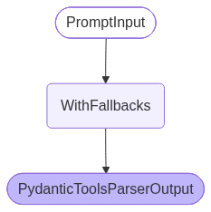
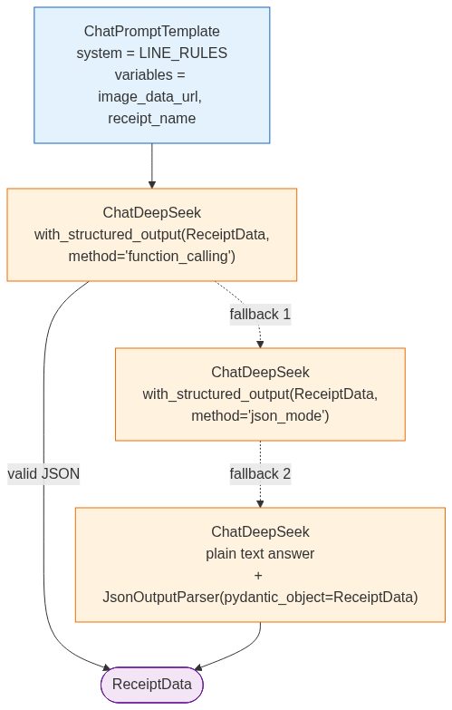
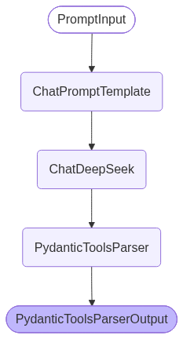
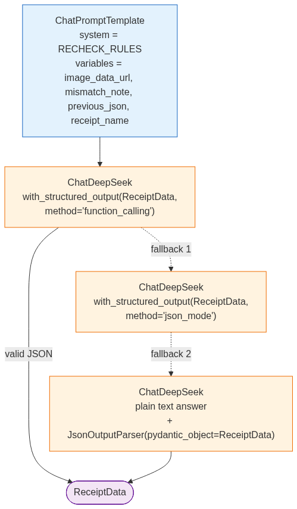

# FTEC5660 Homework 1: Receipt Chain

Build a LangChain pipeline that reads every supermarket receipt in a folder
with the vision-capable DeepSeek Flash model and answers these two questions:

1. How much money did I spend in total for these bills?
2. How much would I have had to pay without the discount?

For this homework, **amount spent** means the final payment after the receipt's
rounding line. **Without the discount** means the sum of the original positive
item prices: add back every promotion, coupon, member, app, packaging-damage,
and percentage discount, but do not add back rounding.

## Student task

Only edit the two functions in `hw1.py` that contain `### YOUR CODE HERE`:

- `build_chain()` creates your LangChain chain.
- `answer_queries()` runs the chain on the receipt images and returns one final
  response for each question.

You may use prompt chaining, routing, parallel calls, reflection, or a
combination. Your final responses should each contain one HKD amount. Do not
hard-code filenames or public answers; grading uses unseen receipt folders.

## Setup and public test

```bash
python3 -m venv .venv
source .venv/bin/activate
pip install -r requirements.txt
```

Put your DeepSeek key after `DEEPSEEK_API_KEY=` in `.env`, then run:

```bash
python3 hw1.py --image-folder public_test
```

The program creates `results.csv` in the current directory. Its columns are
`query`, `model_response`, and `correctness`. The public answers are in
`public_test/ground_truth.json`. The starter intentionally returns the dummy
response `please design your chain to answer these two queries.` so it runs
before you add any API code.

The required model is `deepseek-v4-flash-vision-exp`, the vision-capable
DeepSeek Flash model. JPEG, PNG, GIF, and WebP inputs are accepted by the
homework runner.


## Homework 1 solution: 
> to students: please fill your solution description here.
Name: Yanyu Lu

By the way, before filling in my code, I try to test the exist code and find I create ".env" file
as ".txt" and it cannot pass the recognition of "load_env_file" function, only then I change it to
".utf-8", it can run.

* build_chain()
Step 1: Define the class "ReceiptLine" and "ReceiptData" to record items, discounts, 
subtotal, rouding, amount_paid .etc .

Step 2: Define two chains' prompts/rules.
one is for extracting the data from image
another is for rechecking the image which
cannot pass the sum test(paid + rouding + discount == paid_without_discounts).

Step 3: Use the defined class "ReceiptData"
to make structured output(.json/dict).

* answer_queries()

Step 1: Set several variable and function to help checking.
- CENT: round result to 2 decimal places
- TOLERANCE: tolerate 3 decimal places error
- DEFAULT_CONCURRENCY: the max images synchronously sent to vision model

the core function is "_summarize()"
it summarize the data from model and check the answers if they are correct(the result should be less than tolerance).
And the result which cannot pass the checking, its image should be sent to recheck_chain to do the second extract.

Step 2: Read every receipt photo in parallel, use extract_chain.batch()
this step would store the image_path which cannot pass the sum_check into the retried_jobs array.

Step 3: The images_path in retried_jobs would be sent to recheck_chain
and be extracted data again.

Step 4: Summarize all the results from summary array and structured output 
like {"QUERY_1": {answer_1}, "QUERY_2": {answer_2}} 

## Chain diagrams

To show the structure of my solution I also draw the graphs of the two chains.
`visualize_chains.py` copies the chain code of `hw1.py` verbatim (the schema, the two rule
lists, both prompts, `_structured_chain()` and the `ChatDeepSeek` model instance) and only
calls `Runnable.get_graph()`, never `invoke()` / `batch()`. It therefore renders the pictures
**without any API call** and without a real `DEEPSEEK_API_KEY`. The output goes to
`chain_graphs/`:

```bash
python3 visualize_chains.py            # *.mmd + chains.md + chains.html (offline)
python3 visualize_chains.py --png      # additionally render the *.png via mermaid.ink (internet)
```

`chains.html` / `chains.md` show all 10 diagrams (and the node list of each one) in one place,
the `*.mmd` files are the Mermaid sources and the `*.png` files the rendered pictures. A bonus
`chains.ascii.txt` is written only when `grandalf` happens to be installed, otherwise that step
just prints a hint and continues. `--out-dir` changes the output folder.

### What langchain draws by itself

langchain-core gives `RunnableWithFallbacks` no `get_graph()` of its own, so the graph of a
whole chain collapses into three nodes and the fallback order becomes invisible:



`PromptInput -> WithFallbacks -> PydanticToolsParserOutput`. To show the real structure I draw
the logical diagram by hand: the blue box is the prompt with its input variables, the orange
boxes are the branches of `with_fallbacks()` in order, the dashed arrows are the fallbacks and
the purple box is what `build_chain()` returns.

### extract_chain



* `ChatPromptTemplate` with `system=LINE_RULES` and the variables `image_data_url`,
  `receipt_name`.
* first branch: `ChatDeepSeek.with_structured_output(ReceiptData, method="function_calling")`,
  which returns a `ReceiptData` object directly.
* if that branch fails (unusable tool call), `with_fallbacks()` continues with fallback 1,
  `method="json_mode"`, and then with fallback 2, a plain text answer read by
  `JsonOutputParser(pydantic_object=ReceiptData)`. The first branch that returns a valid
  `ReceiptData` wins, so a single bad answer does not lose the receipt.
* the node chain of the main branch:



| branch | nodes |
| --- | --- |
| `function_calling` (main) | `ChatPromptTemplate -> ChatDeepSeek -> PydanticToolsParser -> PydanticToolsParserOutput` |
| `json_mode` (fallback 1) | `ChatPromptTemplate -> ChatDeepSeek -> PydanticOutputParser -> ReceiptData` |
| `json_parser` (fallback 2) | `ChatPromptTemplate -> ChatDeepSeek -> JsonOutputParser -> JsonOutputParserOutput` |

### recheck_chain



* same schema and same three fallbacks, but `system=RECHECK_RULES` and four variables:
  `image_data_url`, `mismatch_note`, `previous_json`, `receipt_name`. The mismatch note and my
  first `ReceiptData` are what the model needs in order to re-read the image and correct itself.
* the three branch sub-graphs are the same as the extract ones (same template and model, only
  the system text differs), so only the extract branch pictures are shown above.

| file | content |
| --- | --- |
| `chains.html`, `chains.md` | all 10 diagrams plus their node lists |
| `extract_overview.png`, `recheck_overview.png` | `get_graph()` of the whole chain (3 nodes) |
| `extract_logical.png`, `recheck_logical.png` | hand-drawn call logic and fallback order |
| `extract_branch_*.png`, `recheck_branch_*.png` | one picture per fallback branch |
