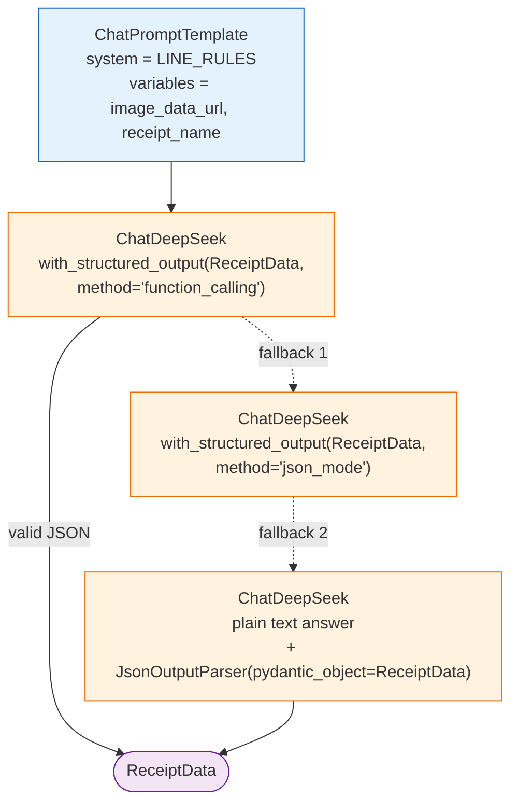
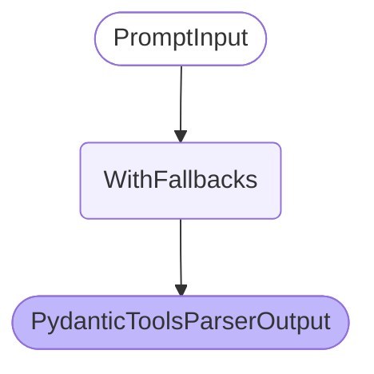
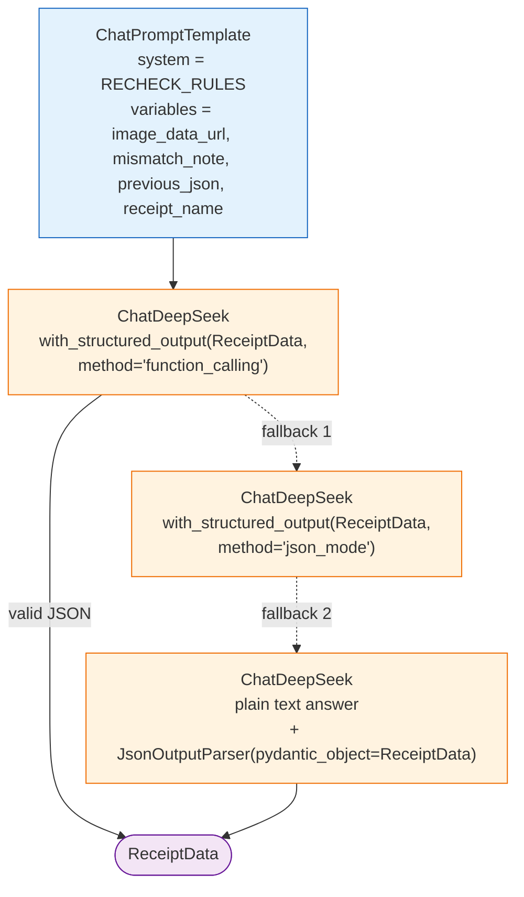
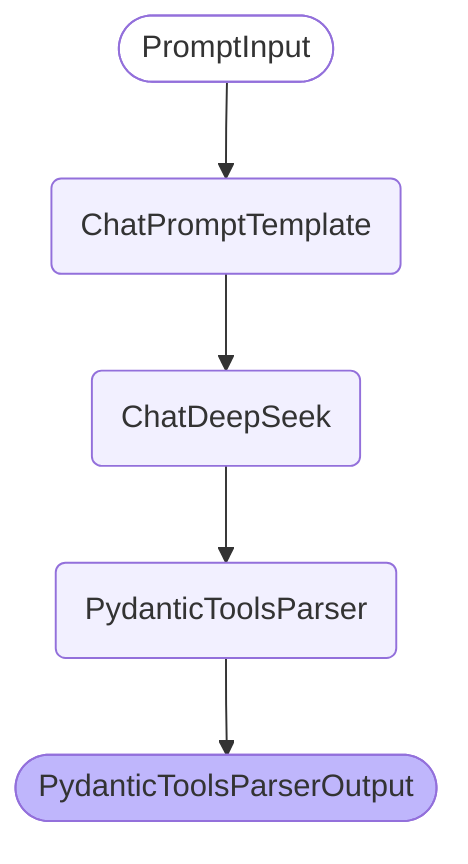
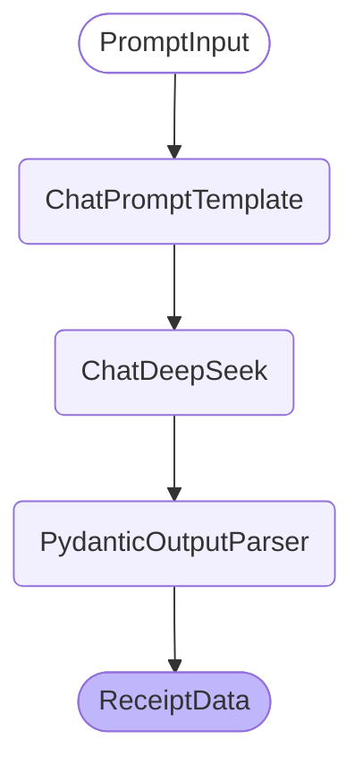
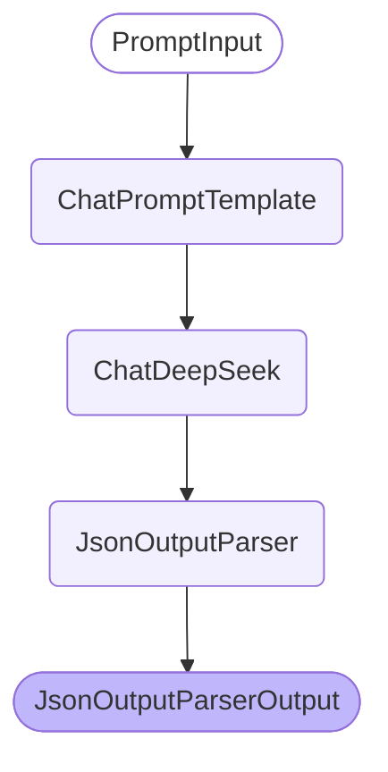

# hw1.py chains: extract / recheck

Generated by `visualize_chains.py` (model: `deepseek-v4-flash-vision-exp`). Every graph below comes from
`get_graph()` on the real chain copied out of `hw1.py`; no model call is made anywhere.
The `logical` diagram is hand written because `with_fallbacks()` is drawn as a single node.

## 1. extract chain: call logic and fallback order (hand written)

`prompt variables: image_data_url, receipt_name`

## 2. extract chain: langchain get_graph() of the whole chain

`RunnableWithFallbacks collapses into one node - see the logical diagram`

## 3. extract fallback branch: function_calling

`ChatPromptTemplate -> _ChatModelBinding -> PydanticToolsParser`

## 4. extract fallback branch: json_mode

`ChatPromptTemplate -> _ChatModelBinding -> PydanticOutputParser`

## 5. extract fallback branch: json_parser

`ChatPromptTemplate -> ChatDeepSeek -> JsonOutputParser`

## 6. recheck chain: call logic and fallback order (hand written)

`prompt variables: image_data_url, mismatch_note, previous_json, receipt_name`

## 7. recheck chain: langchain get_graph() of the whole chain

`RunnableWithFallbacks collapses into one node - see the logical diagram`

## 8. recheck fallback branch: function_calling

`ChatPromptTemplate -> _ChatModelBinding -> PydanticToolsParser`

## 9. recheck fallback branch: json_mode

`ChatPromptTemplate -> _ChatModelBinding -> PydanticOutputParser`

## 10. recheck fallback branch: json_parser

`ChatPromptTemplate -> ChatDeepSeek -> JsonOutputParser`
